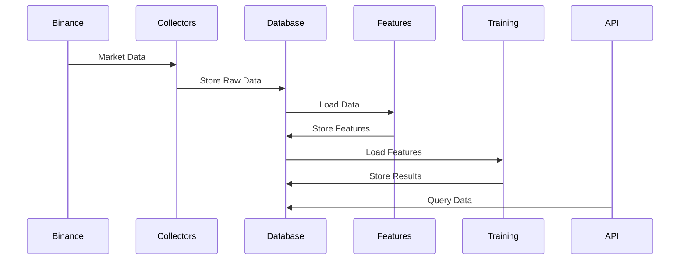

# Don Trading Framework Architecture

## System Overview
The Don Trading Framework is a sophisticated Bitcoin futures trading system built on top of the Binance exchange. The framework provides real-time data collection, feature calculation, and reinforcement learning capabilities for automated trading strategies.

## Core Components

### 1. Data Collection Layer
- **Market Data Collector**: Interfaces with Binance API to collect OHLCV data
- **Trade Data Collector**: Captures individual trade executions
- **Order Book Collector**: Maintains real-time order book state
- **Liquidation Monitor**: Tracks liquidation events

### 2. Database Layer
- **Time Series Storage**: Efficient storage of market data using partitioned tables
- **Feature Store**: Pre-calculated technical indicators and features
- **Model Storage**: Trained models and their metadata
- **Training History**: Training runs and performance metrics

### 3. Feature Calculation Engine
- **Technical Indicators**: Standard technical analysis features
- **Microstructure Features**: Order book and trade-based features
- **Custom Features**: User-defined feature calculations

### 4. Training System
- **RL Environment**: Custom OpenAI Gym environment
- **Model Training**: Reinforcement learning model training
- **Performance Monitoring**: Real-time training metrics
- **Model Evaluation**: Backtesting and forward testing

### 5. Dashboard & API
- **REST API**: Data access and system control
- **Real-time Metrics**: WebSocket-based live updates
- **Visualization**: Trading and performance charts

## Data Flow



## Security Architecture

### Authentication & Authorization
- API key-based authentication
- Role-based access control
- Rate limiting per user/role

### Data Security
- Encrypted configuration storage
- Secure API key rotation
- Audit logging

## Deployment Architecture

### Components
- PostgreSQL database (partitioned)
- FastAPI application server
- Redis cache (for rate limiting)
- Background workers (for data collection)

### Scalability
- Horizontal scaling of API servers
- Database read replicas
- Caching layer for hot data

## Monitoring & Maintenance

### Performance Monitoring
- Query performance tracking
- API response times
- System resource usage

### Data Management
- Automated data archival
- Backup strategy
- Data retention policies

## Development Workflow

### Code Organization
```
don/
├── src/
│   ├── don/
│   │   ├── cli/         # Command-line interface
│   │   ├── data/        # Data collection
│   │   ├── database/    # Database models
│   │   ├── features/    # Feature calculation
│   │   ├── rl/          # Reinforcement learning
│   │   └── dashboard/   # API & visualization
├── tests/               # Test suite
└── docs/               # Documentation
```

### Development Process
1. Feature branches for development
2. Comprehensive test coverage
3. Code review process
4. Continuous integration
5. Automated deployment

## Future Enhancements
1. Additional exchange support
2. Advanced feature engineering
3. Multiple asset trading
4. Enhanced visualization
5. Automated strategy optimization
