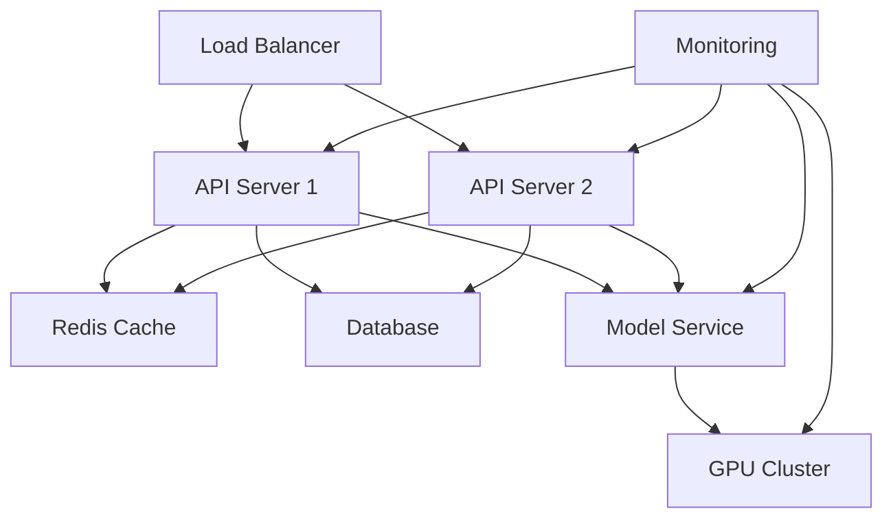

# Production Deployment Guide

This guide covers the production deployment setup for the Bitcoin Trading RL project, including security, monitoring, and scaling considerations.

## Architecture Overview



## Production Configuration

### 1. Environment Setup

Create a production environment file:

```bash
cp .env.example .env.production
```

Configure production settings:

```env
# .env.production
ENVIRONMENT=production
LOG_LEVEL=INFO
DEBUG=false

# API Keys
BINANCE_API_KEY=your_key
BINANCE_API_SECRET=your_secret
NEWSAPI_KEY=your_key
TWITTER_API_KEY=your_key

# Database
DB_HOST=your_db_host
DB_PORT=5432
DB_NAME=bitcoin_trading
DB_USER=your_user
DB_PASSWORD=your_password

# Redis
REDIS_HOST=your_redis_host
REDIS_PORT=6379
REDIS_PASSWORD=your_password

# Security
JWT_SECRET=your_jwt_secret
ALLOWED_HOSTS=*.your-domain.com
```

### 2. Docker Production Setup

Create production Docker Compose configuration:

```yaml
# docker-compose.prod.yml
version: "3.8"

services:
  api:
    build:
      context: .
      dockerfile: Dockerfile
      target: production
    image: bitcoin_trading_rl:${VERSION:-latest}
    restart: always
    env_file: .env.production
    deploy:
      replicas: 2
      resources:
        limits:
          cpus: "1"
          memory: 2G
    healthcheck:
      test: ["CMD", "curl", "-f", "http://localhost:8000/health"]
      interval: 30s
      timeout: 10s
      retries: 3

  model:
    build:
      context: .
      dockerfile: Dockerfile.model
      target: production
    image: bitcoin_trading_model:${VERSION:-latest}
    deploy:
      resources:
        reservations:
          devices:
            - driver: nvidia
              count: 1
              capabilities: [gpu]

  redis:
    image: redis:6-alpine
    command: redis-server --requirepass ${REDIS_PASSWORD}
    volumes:
      - redis_data:/data

  prometheus:
    image: prom/prometheus:v2.30.3
    volumes:
      - ./prometheus.yml:/etc/prometheus/prometheus.yml
      - prometheus_data:/prometheus

  grafana:
    image: grafana/grafana:8.2.0
    volumes:
      - grafana_data:/var/lib/grafana

volumes:
  redis_data:
  prometheus_data:
  grafana_data:
```

### 3. Security Configuration

#### SSL/TLS Setup

```nginx
# nginx.conf
server {
    listen 443 ssl http2;
    server_name api.your-domain.com;

    ssl_certificate /etc/letsencrypt/live/api.your-domain.com/fullchain.pem;
    ssl_certificate_key /etc/letsencrypt/live/api.your-domain.com/privkey.pem;

    ssl_protocols TLSv1.2 TLSv1.3;
    ssl_ciphers HIGH:!aNULL:!MD5;

    location / {
        proxy_pass http://api:8000;
        proxy_set_header Host $host;
        proxy_set_header X-Real-IP $remote_addr;
    }
}
```

#### Firewall Rules

```bash
# Allow only necessary ports
ufw allow 443/tcp
ufw allow 80/tcp
ufw allow 22/tcp
ufw enable
```

### 4. Monitoring Setup

#### Prometheus Configuration

```yaml
# prometheus.yml
global:
  scrape_interval: 15s

scrape_configs:
  - job_name: "bitcoin_trading"
    static_configs:
      - targets: ["api:8000", "model:8001"]

  - job_name: "node_exporter"
    static_configs:
      - targets: ["node-exporter:9100"]
```

#### Grafana Dashboards

Create monitoring dashboards for:

- System metrics (CPU, Memory, GPU)
- Application metrics (requests, latency)
- Model metrics (predictions, accuracy)
- Trading metrics (positions, PnL)

### 5. Scaling Configuration

#### Kubernetes Deployment

```yaml
# kubernetes/deployment.yaml
apiVersion: apps/v1
kind: Deployment
metadata:
  name: bitcoin-trading
spec:
  replicas: 3
  selector:
    matchLabels:
      app: bitcoin-trading
  template:
    metadata:
      labels:
        app: bitcoin-trading
    spec:
      containers:
        - name: api
          image: bitcoin_trading_rl:latest
          resources:
            limits:
              cpu: "1"
              memory: "2Gi"
          readinessProbe:
            httpGet:
              path: /health
              port: 8000
```

### 6. Backup Configuration

```bash
#!/bin/bash
# backup.sh

# Database backup
pg_dump -h $DB_HOST -U $DB_USER $DB_NAME > backup_$(date +%Y%m%d).sql

# Model checkpoints backup
rsync -av /path/to/checkpoints/ /backup/checkpoints/

# Encrypt backup
gpg -c backup_$(date +%Y%m%d).sql
```

## Deployment Steps

1. Build production images:

   ```bash
   make ci-build VERSION=1.0.0
   ```

2. Run security checks:

   ```bash
   make ci-security
   ```

3. Deploy to production:

   ```bash
   docker-compose -f docker-compose.prod.yml up -d
   ```

4. Verify deployment:
   ```bash
   make health-check
   ```

## Monitoring and Maintenance

### 1. Health Checks

```python
# src/api/health.py
@app.route('/health')
async def health_check():
    return {
        'status': 'healthy',
        'version': '1.0.0',
        'database': check_database(),
        'redis': check_redis(),
        'model': check_model_service()
    }
```

### 2. Logging

```python
# src/utils/logger.py
logger = logging.getLogger('production')
logger.setLevel(logging.INFO)
handler = logging.handlers.RotatingFileHandler(
    'logs/production.log',
    maxBytes=10000000,
    backupCount=5
)
```

### 3. Alerts

```yaml
# alertmanager.yml
receivers:
  - name: "team-alerts"
    slack_configs:
      - channel: "#alerts"
        api_url: "https://hooks.slack.com/services/XXX/YYY/ZZZ"

route:
  receiver: "team-alerts"
  group_wait: 30s
  group_interval: 5m
  repeat_interval: 4h
```

## Performance Tuning

### 1. Database Optimization

```sql
-- Create indexes
CREATE INDEX idx_timestamp ON trades(timestamp);
CREATE INDEX idx_symbol ON trades(symbol);

-- Optimize queries
EXPLAIN ANALYZE
SELECT * FROM trades
WHERE timestamp > NOW() - INTERVAL '1 day'
  AND symbol = 'BTCUSDT';
```

### 2. Caching Strategy

```python
# src/utils/cache.py
async def get_cached_data(key: str) -> Optional[dict]:
    """Get data from Redis cache."""
    if cached := await redis.get(key):
        return json.loads(cached)
    return None

async def cache_data(key: str, data: dict, ttl: int = 300):
    """Cache data with TTL."""
    await redis.setex(key, ttl, json.dumps(data))
```

## Rollback Procedures

### 1. Version Rollback

```bash
# Roll back to previous version
make rollback VERSION=1.0.0
```

### 2. Data Rollback

```bash
# Restore database
psql -h $DB_HOST -U $DB_USER $DB_NAME < backup_20240323.sql

# Restore model checkpoints
rsync -av /backup/checkpoints/ /path/to/checkpoints/
```

## Security Measures

### 1. API Security

```python
# src/api/security.py
@app.middleware("http")
async def security_middleware(request, call_next):
    # Rate limiting
    await rate_limiter.check(request)

    # JWT validation
    validate_jwt(request)

    # Input validation
    validate_input(request)

    response = await call_next(request)

    # Security headers
    response.headers["X-Content-Type-Options"] = "nosniff"
    response.headers["X-Frame-Options"] = "DENY"
    return response
```

### 2. Data Security

```python
# src/utils/encryption.py
def encrypt_sensitive_data(data: str) -> str:
    """Encrypt sensitive data before storage."""
    fernet = Fernet(ENCRYPTION_KEY)
    return fernet.encrypt(data.encode()).decode()
```

## Troubleshooting

### Common Issues

1. High Memory Usage:

   ```bash
   # Check memory usage
   docker stats

   # Clear Redis cache if needed
   redis-cli FLUSHALL
   ```

2. High CPU Usage:

   ```bash
   # Check process usage
   top -b -n 1

   # Profile Python code
   python -m cProfile src/main.py
   ```

3. Slow Database Queries:
   ```sql
   -- Find slow queries
   SELECT * FROM pg_stat_activity
   WHERE state = 'active'
   ORDER BY duration DESC;
   ```

## Maintenance Schedule

1. Daily:

   - Monitor system health
   - Check error logs
   - Verify backups

2. Weekly:

   - Update security patches
   - Review performance metrics
   - Clean up old logs

3. Monthly:
   - Full system backup
   - Security audit
   - Performance optimization

## Support and Escalation

1. Level 1: Development Team

   - Response time: 30 minutes
   - Handle common issues

2. Level 2: DevOps Team

   - Response time: 1 hour
   - Handle infrastructure issues

3. Level 3: Senior Engineers
   - Response time: 2 hours
   - Handle critical issues
