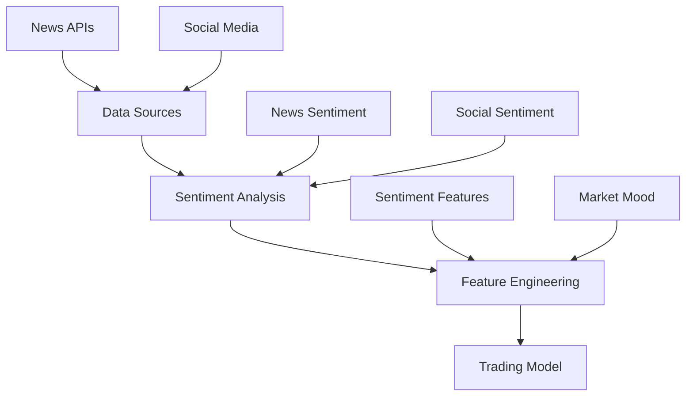

# Sentiment Analysis

The sentiment analysis module provides comprehensive market sentiment analysis by integrating news and social media data. This guide explains how to use and configure the sentiment analysis features.

## Overview

The sentiment analysis system consists of several components:

1. News sentiment analysis
2. Social media sentiment analysis
3. Sentiment aggregation
4. Feature engineering
5. Market mood indicators

## Architecture



## Configuration

Configure sentiment analysis in `configs/config.yaml`:

```yaml
sentiment:
  news:
    apis:
      - name: "newsapi"
        key: "${NEWSAPI_KEY}"
        endpoints:
          - "everything"
          - "top-headlines"
      - name: "cryptocompare"
        key: "${CRYPTOCOMPARE_KEY}"
  social:
    twitter:
      api_key: "${TWITTER_API_KEY}"
      api_secret: "${TWITTER_API_SECRET}"
      access_token: "${TWITTER_ACCESS_TOKEN}"
      access_secret: "${TWITTER_ACCESS_SECRET}"
      keywords:
        - "bitcoin"
        - "btc"
        - "crypto"
    reddit:
      client_id: "${REDDIT_CLIENT_ID}"
      client_secret: "${REDDIT_CLIENT_SECRET}"
      subreddits:
        - "bitcoin"
        - "cryptocurrency"
        - "bitcoinmarkets"
  analysis:
    window_size: "1h"
    update_interval: 300 # seconds
    features:
      - "sentiment_score"
      - "sentiment_momentum"
      - "sentiment_volatility"
      - "extreme_sentiment"
      - "sentiment_divergence"
    weights:
      news: 0.6
      social: 0.4
```

## Usage

### Basic Usage

```python
from src.data.sentiment_analyzer import SentimentAnalyzer

# Initialize analyzer
analyzer = SentimentAnalyzer(config)

# Fetch sentiment data
news_sentiment = await analyzer.fetch_news_sentiment(start_time, end_time)
social_sentiment = await analyzer.fetch_social_sentiment(start_time, end_time)

# Aggregate sentiment
sentiment_df = analyzer.aggregate_sentiment(news_sentiment, social_sentiment)

# Calculate features
features = analyzer.calculate_sentiment_features(sentiment_df)
```

### Integration with Feature Engineering

The sentiment analysis is automatically integrated into the feature engineering pipeline:

```python
from src.features.feature_engineering import FeatureEngineer

# Initialize feature engineer
engineer = FeatureEngineer(input_file, output_dir, config=config)

# Generate features (includes sentiment)
await engineer.generate_features()
```

## Features

### News Sentiment

- Real-time news sentiment analysis
- Multiple news source integration
- Weighted sentiment scoring
- Impact score calculation

### Social Media Sentiment

- Twitter sentiment analysis
- Reddit community sentiment
- Engagement-weighted scoring
- Platform-specific features

### Sentiment Features

1. **Composite Sentiment**

   - Weighted combination of news and social sentiment
   - Range: [-1, 1]
   - Weight configuration via config file

2. **Sentiment Momentum**

   - Rate of sentiment change
   - Indicates sentiment trend direction
   - Useful for trend prediction

3. **Sentiment Volatility**

   - Standard deviation of sentiment
   - Indicates market uncertainty
   - Rolling window calculation

4. **Extreme Sentiment**

   - Detection of outlier sentiment
   - Based on statistical thresholds
   - Indicator of potential market moves

5. **Sentiment Divergence**
   - Difference between news and social sentiment
   - Indicates potential market inefficiencies
   - Used for market regime detection

## Market Mood Indicators

The system provides several market mood indicators:

- **Sentiment Trend**: Overall market sentiment direction
- **Sentiment Regime**: Current market sentiment state
- **Sentiment Reversal**: Potential sentiment shift signals
- **Sentiment Consensus**: Agreement between different sources

## Performance Considerations

### Optimization

- Parallel processing for sentiment analysis
- Efficient data caching
- Rate limiting for API calls
- Memory-efficient feature calculation

### API Rate Limits

Be aware of API rate limits:

- NewsAPI: 500 requests/day (free tier)
- Twitter: 500,000 tweets/month
- Reddit: 60 requests/minute

## Error Handling

The system includes robust error handling:

```python
try:
    sentiment_features = await analyzer.calculate_sentiment_features(data)
except Exception as e:
    logger.error(f"Error calculating sentiment features: {e}")
    # Fallback to default features
    sentiment_features = pd.DataFrame()
```

## Monitoring

Monitor sentiment analysis performance:

```python
# Get sentiment metrics
metrics = analyzer.get_sentiment_metrics()

# Log to monitoring system
logger.info("Sentiment Analysis Metrics", extra={
    "sentiment_coverage": metrics.coverage,
    "api_success_rate": metrics.success_rate,
    "processing_time": metrics.processing_time
})
```

## Best Practices

1. **API Keys**

   - Store API keys in environment variables
   - Use API key rotation for high availability
   - Monitor API usage and limits

2. **Data Quality**

   - Validate sentiment data sources
   - Handle missing or invalid data
   - Implement data quality checks

3. **Performance**

   - Use appropriate window sizes
   - Implement caching for frequent requests
   - Monitor memory usage

4. **Integration**
   - Test sentiment impact on model
   - Validate feature importance
   - Monitor sentiment correlation with price

## Troubleshooting

Common issues and solutions:

1. **API Connection Issues**

   - Check API keys and permissions
   - Verify network connectivity
   - Monitor rate limits

2. **Data Quality Issues**

   - Validate input data
   - Check for missing values
   - Verify timestamp alignment

3. **Performance Issues**
   - Adjust window sizes
   - Optimize cache settings
   - Monitor memory usage

## Future Developments

Planned enhancements:

- Additional news sources integration
- Enhanced social media coverage
- Advanced NLP models
- Real-time sentiment streaming
- Custom sentiment indicators

## API Reference

For detailed API documentation, see the [Sentiment Analysis API Reference](../api/sentiment.md).
